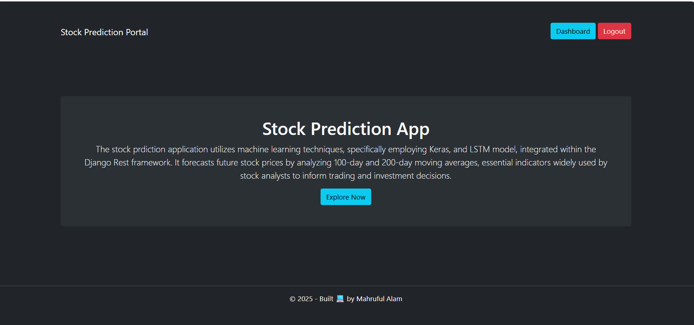
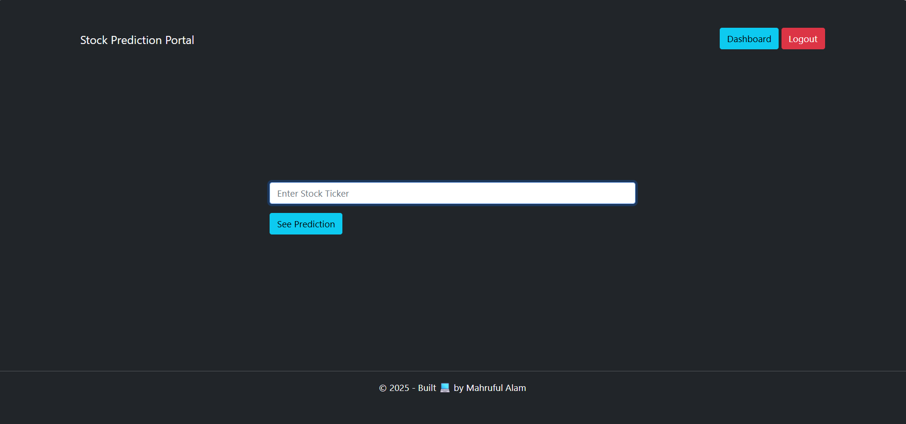
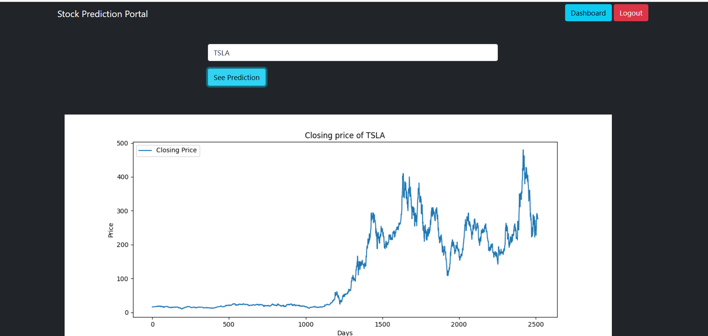
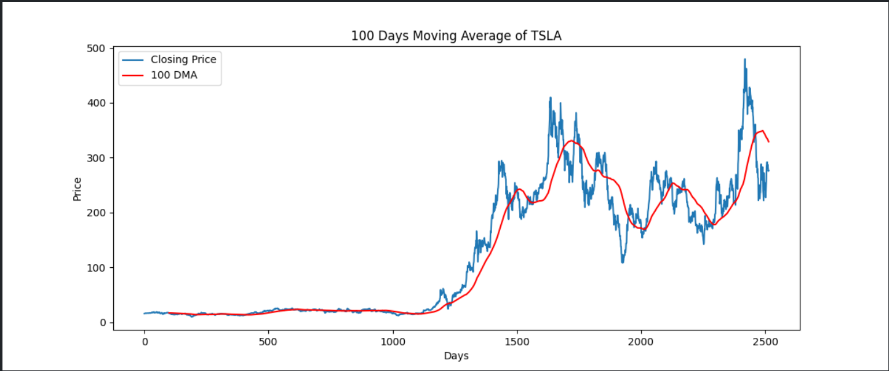
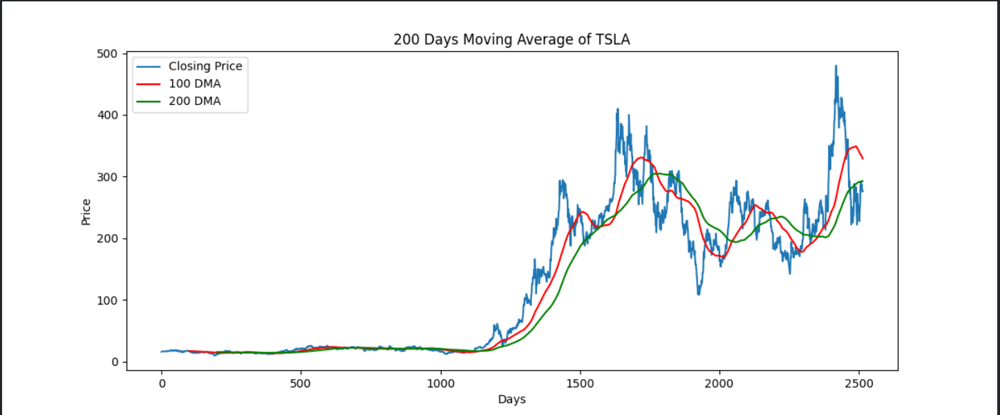
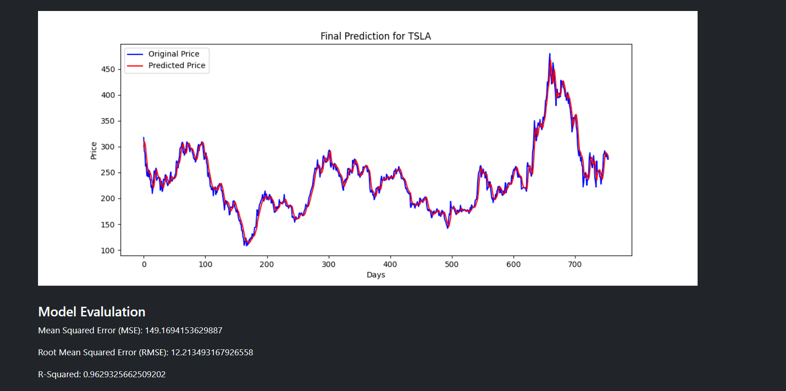

# 📈 Stock Prediction App

This is a web-based Stock Prediction App that uses machine learning (LSTM model via Keras) to predict stock prices. The app is built using **React** for frontend and **Django Rest Framework (DRF)** for the backend and integrates an ML model to visualize and forecast stock trends.

---

## 🚀 Features

- 🔍 Enter any stock ticker symbol to view predictions
- 📊 Displays historical closing prices in an interactive chart
- 🧠 Utilizes LSTM (Long Short-Term Memory) neural networks for predictions
- ⚙️ Backend built with Django Rest Framework
- 🖥️ Simple and intuitive UI

---

## 🛠️ Tech Stack

- **Frontend**: React JS
- **Backend**: Django Rest Framework
- **ML/AI**: Keras, TensorFlow, LSTM
- **Data**: Likely sourced from Yahoo Finance

---

## 📷 Screenshots

### Home Page


### Prediction Input Page


### Result Graph

### 100 Days Moving Average

### 200 Days Moving Average

### Final Prediction


---

## 🧪 How It Works

1. User enters a stock ticker (e.g., `TSLA`,`AAPL `,`BTC `,`GOOGL`).
2. The app fetches historical stock data.
3. The LSTM model processes and predicts future prices based on 100-day and 200-day moving averages.
4. A graph is displayed with the stock's historical performance.

---

## 🧰 Setup Instructions

1. Clone the repository:
   ```bash
   git clone https://github.com/CoderMahruf/stock-prediction-portal

2. Create and activate a virtual environment:
   ``` bash
   python -m venv env
   source env\Scripts\activate  # For Windows

3. Install dependencies:
   ``` bash
   pip install -r requirements.txt


4. Install dependencies:
   ``` bash
   python manage.py runserver

## 🧑‍💻 Author
Built with 🖥️ by Mahruful Alam